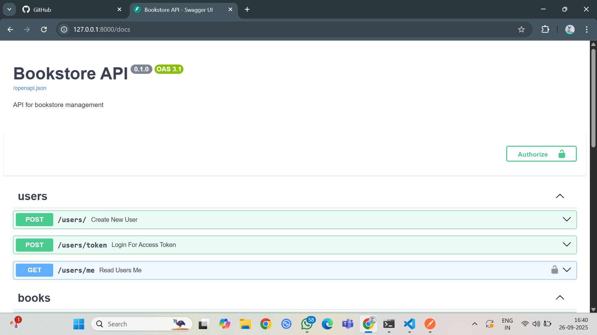
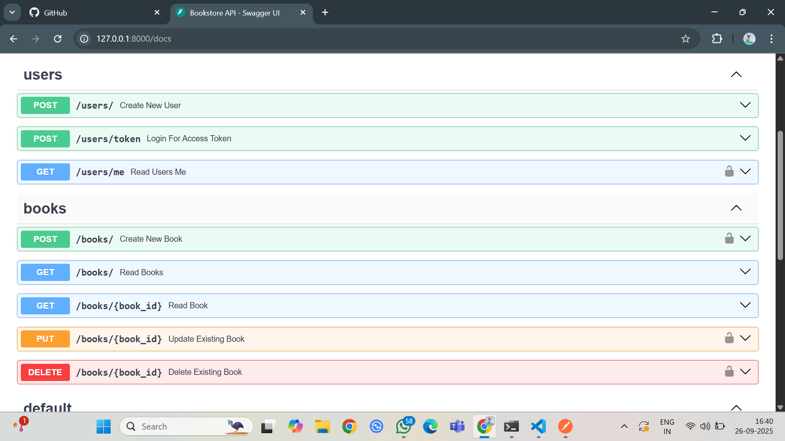
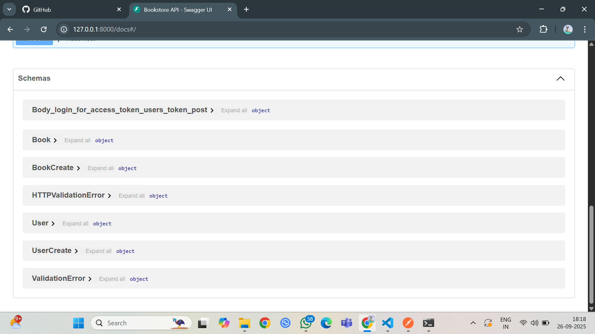
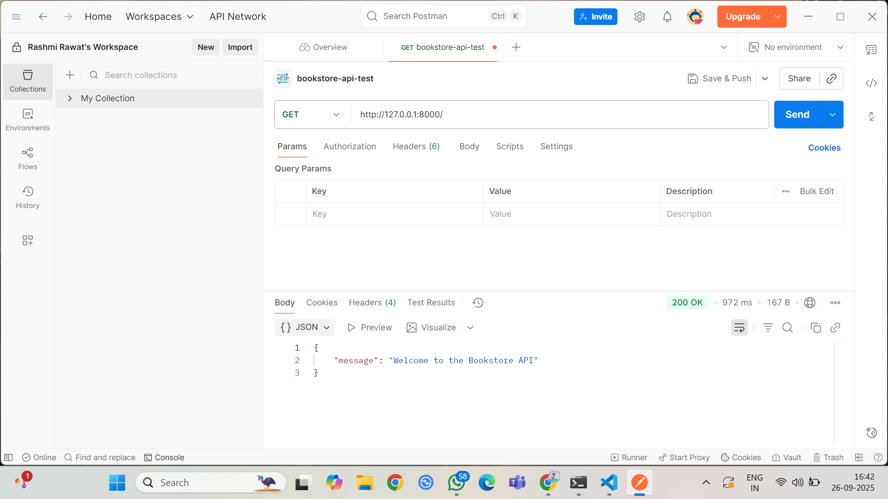

# Bookstore API

Welcome to the Bookstore API, a RESTful API for managing an online bookstore'users and book inventory using FastAPI and SQLite. This project was developed as part of the DevOps Internship Task 4, focusing on Git workflows.

## Setup Instructions
1. Clone the repo: `git clone https://github.com/rashmirawat1/bookstore-api.git`
2. Create virtual env: `python -m venv env`
3. Activate: `env\Scripts\activate` (Windows)
4. Install deps: `pip install -r requirements.txt`
5. Run the API: `uvicorn main:app --reload`
6. Access docs: http://127.0.0.1:8000/docs

## Features
- User registration and login with JWT authentication
- Book management (CRUD)
- Error handling with HTTP exceptions and database transaction rollbacks.
- Database persistence

## Git Practices
- *a. Initialize repo and push to GitHub*: Achieved with git init, git remote add, and initial git push.
- *b. Create dev, feature, and main branches*: Implemented with git checkout -b for dev, feature/advanced-auth, and feature/error-handling.
- *c. Use pull requests to merge*: Executed via GitHub PRs and git pull after merging.
- *d. Resolve any merge conflicts*: Practiced with a simulated resolution workflow.
- *e. Add a .gitignore file*: Added with specific exclusions and committed.
- *f. Document all tasks using markdown*: Maintained in docs/tasks.md and this README.md.

## API Endpoints
| Endpoint       | Method | Description                  | Auth Required |
|----------------|--------|------------------------------|---------------|
| /users/       | POST   | Register user                | No            |
| /users/token  | POST   | Login for token              | No            |
| /books/       | POST   | Create book                  | Yes           |
| /books/       | GET    | List books                   | No            |
| /books/{id}   | GET    | Get book                     | No            |
| /books/{id}   | PUT    | Update book                  | Yes           |
| /books/{id}   | DELETE | Delete book                  | Yes           |

## Screenshots

### Bookstore-API
  

## Postman Testing
